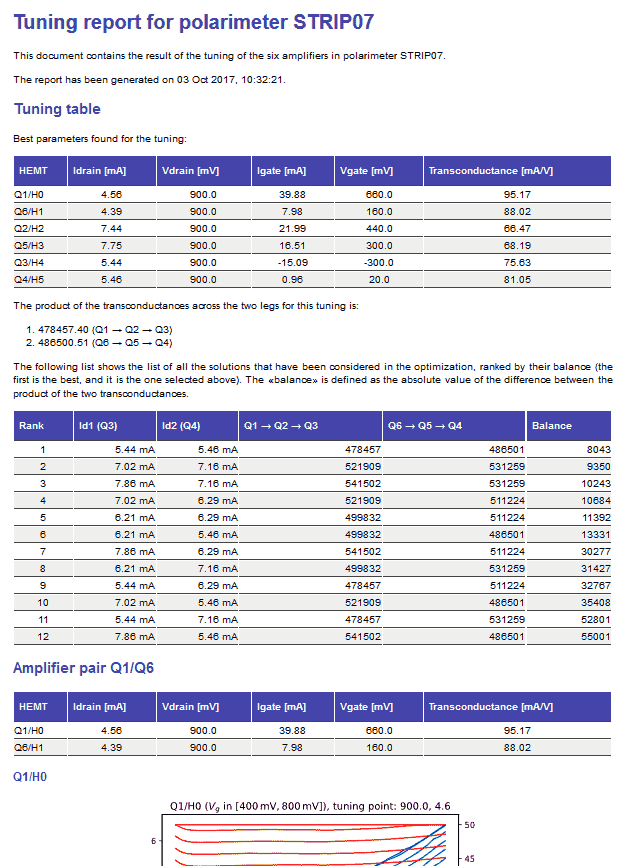

STRIP polarimeter tuning
========================

This repository contains a number of Python program which can be used to analyze
the Strip tuning data. These data have been acquired during the unit tests done
in the laboratories at the University of Milano Bicocca in 2017. 

The following programs have been implemented so far::

1. `Striptun`_ reads the data acquired with the Keithley machine used at the
   Bicocca labs and produces a report containing the tuning parameters of the six
   HEMTs used in Strip's polarimeters.

2. `Tnoise`_ reads the data acquired during the so-called «Y-factor» test and
   runs an analysis to determine the gain and the noise temperature of the
   polarimeter.

3. `Average output`_ determines the average output of a test. It is mainly used
   to study the data acquired with all six HEMTs turned off, in order to
   estimate the average ADU offset to be removed from the PWR data.

All the programs save the results of their calculations in JSON files, and they
are able to produce reports in `Markdown
<https://daringfireball.net/projects/markdown/>`_ and HTML formats. The Markdown
format is useful when used in conjunction with the program `Pandoc
<http://pandoc.org>`_, as it can be easily converted to a variety of other
formats (LaTeX, Microsoft Word, etc.).

This repository contains a database of the parameters used during the tests in
Bicocca
(https://github.com/lspestrip/striptun/blob/master/polarimeter_info.yaml), which
is used by the scripts listed above. Any operator should update this file any
time a new polarimeter is tested. If you do not have access rights to this
repository, you should fork the repository, make your changes, and open a pull
request.

Installation
------------

All the programs need the following packages:

- `Mako <https://pypi.python.org/pypi/mako>`_ (templating engine)
- `Markdown <https://pypi.python.org/pypi/Markdown>`_ (markdown to HTML conversion)
- `Matplotlib <https://pypi.python.org/pypi/matplotlib>`_ (plotting library)
- `NumPy <https://pypi.python.org/pypi/numpy>`_ (vector/matrix operations)
- `SciPy <https://pypi.python.org/pypi/scipy>`_ (interpolation)
- `SimpleJSON <https://pypi.python.org/pypi/simplejson>`_ (JSON export)
- `Xlrd <https://pypi.python.org/pypi/xlrd>`_ (Excel file importing)

If you are using `Anaconda Python <https://www.anaconda.com/>`_, you can install them 
using the command ``conda``::

    conda install mako markdown matplotlib numpy scipy simplejson xlrd

In any other case, you can use ``pip``::

    pip install mako markdown matplotlib numpy scipy simplejson xlrd

Striptun
--------------

This program can be used to find the optimal setpoint for the HEMT biases of a
polarimeters. It tries to balance the two legs by computing the transconductance
of each amplifying stage. It requires the full set of Excel files produced by the
Keithley apparatus.

Usage
+++++

The program does not need to be installed. Just run it with the following
parameters::

     python striptun.py POLARIMETER_NAME INPUT_PATH OUTPUT_PATH

The meaning of the parameters is the following:

- ``POLARIMETER_NAME`` is a string identifying the polarimeter (e.g., ``STRIP07``)

- ``INPUT_PATH`` is the name of the directory containing the files produced by
  Keithley (usually the name is ``prove_DC``, or something similar)

- ``OUTPUT_PATH`` is the name of the directory that will contain the report (if the
  directory does not exist, it will be created silently)

At the end of the execution, the directory ``OUTPUT_PATH`` will contain the following files:

1. A JSON file named ``striptun_results.json``, containing the results of the analysis;

2. A Markdown file named ``striptun_report.md``;

3. An HTML file named ``striptun_report.html``.

Example
+++++++

The following is the beginning of an HTML report produced by the script ``striptun.py``:

How the program works
+++++++++++++++++++++

The program runs the following steps:

1. Read all the Excel files saved by Keithley

2. From the Vd versus Id curve, compute TransHEMT (see below) and plot Vd versus TransHEMT

3. Plot Vd versus Ig and Vg versus Id

4. Set Vd to 0.9 V and find Id ≈ 4 mA (Q1, Q6), Id ≈ 7 mA (Q2, Q5)

5. Find TransHEMT for the Vd and Id found in the previous step 

6. Set Vd to 0.9 V and find Id ≈ 6 mA for Q3

7. Find the configuration which maximizes the match between the product of the
   transconductances across the two legs (Q1→Q2→Q3 and Q6→Q5→Q4)

8. Save all the plots

9. Generate a Markdown report and an HTML report

Transconductance
++++++++++++++++

The formula used to compute transconductance is the following::

    TransHEMT = 1e3 * (Id2 - Id1) / ((Vg2 - Vg1) - 1e4 * (Ig2 - Ig1))

where pairs like ``(Id1, Id2)`` refer to two consecutive lines with different values of Vg.
The factor 1e4 is a resistance, and its presence seems to be due to the partitor.

Tnoise
------

Two programs are implemented to compute the noise temperature. The first one,
``tnoise_step1.py``, automatically detects the time spans where the signal of
the polarimeter was stable enough to assume thermal equilibrium. The output of
this program is used by the second program, ``tnoise_step2.py``, to run a
frequentist/Bayesian analysis on the data and extract the best value of the
gain and noise temperature of the amplifier.

Usage (step 1)
++++++++++++++

To run the first program, use the following parameters::

     python tnoise_step1.py POLARIMETER_NAME INPUT_FILE_NAME OUTPUT_PATH

The meaning of the parameters is the following:

- ``POLARIMETER_NAME`` is a string identifying the polarimeter (e.g., ``STRIP07``)

- ``INPUT_FILE_NAME`` is the name of the text file containing the raw data (in tabular
  format) acquired during the test.

- ``OUTPUT_PATH`` is the name of the directory that will contain the report (if the
  directory does not exist, it will be created silently)

At the end of the execution, the directory ``OUTPUT_PATH`` will contain the following files:

1. A JSON file named ``tnoise_results.json``, containing the results of the analysis;

2. A Markdown file named ``tnoise_report.md``;

3. An HTML file named ``tnoise_report.html``.

The most important result saved by this program is a list of the regions in the
data file where the signal is stable enough to be used in the next step of the
analysis, the determination of the gain and the noise temperature for the
polarimeter.

Usage (step 2)
++++++++++++++

To run the second program, you must have ran ``tnoise_step1.py`` first, as it requires
the JSON file containing the list of temperature steps. The data for the test must have
been saved in the test database as well: if this is not the case, you must provide a
custom test database in YAML format (through the ``--test-db-path`` switch).

The code supposes the following model::

    PWR = 1/4 * (1/2 * (G_A^2 + G_B^2) * (T_A + T_B + 2 T_N) ± trig * G_A * G_B * (T_A - T_B) )

where ``G_A`` and ``G_B`` are the gains of the two legs of the polarimeter, in ,
``T_A`` and ``T_B`` are the brightness temperatures of the two loads, ``trig``
is either cosΔφ or sinΔφ, the term due to the phase difference of the two phase
shifter states. The value of ``trig``, as well as the sign of ``±``, depend on
the power output and the configuration of the phase switches. The code
automatically finds which is the case by determining the number of the «blind
channel», i.e., the channel that stays fixed while load B is changing. The code
tries to find a simultaneous fit for these three parameters:

- ``1/2 * (G_A^2 + G_B^2)`` is the average gain of the polarimeter, in K/ADU

- ``G_A * G_B`` is the product of the gains of the polarimeter, in K/ADU

- ``T_N`` is the overall noise temperature, equal to ``(G_A^2 * T_A + G_B^2 *
  T_B) / (G_A^2 + G_B^2)``

The usage of ``tnoise_step2.py`` is the following, use ``--help`` to get full
help about all the (many) command-line switches::

    python tnoise_step2.py POLARIMETER_NAME RAW_FILE TNOISE1_RESULTS OUTPUT_PATH

The meaning of the parameters is the following:

- ``POLARIMETER_NAME`` is the name of the polarimeter. This must match the entry
  in the test database `polarimeter_info.yaml
  <https://github.com/lspestrip/striptun/blob/master/polarimeter_info.yaml>`_.

- ``RAW_FILE`` is the text file containing all the data acquired during the test

- ``TNOISE1_RESULTS`` is the JSON file produced by ``tnoise_step1.py``, which
  contains the analysis of the data in ``RAW_FILE``

- ``OUTPUT_PATH`` is the name of the directory where results will be saved. This can
  be the same directory as the one created by ``tnoise_step1.py``, as there will be
  no clashes in file names.

By default, the code runs a frequentist analysis of the data, which assumes that
errors are Gaussian and is extremely fast; the Gaussian hypothesis has been
tested on real data and holds with large confidence. The code is able
to run a Bayesian analysis through a Monte Carlo Markow Chain (MCMC) approach,
which is much slower but potentially more insightful. To run the MCMC analysis,
use the ``--mcmc`` flag.

Average output
--------------

This small program does exactly what it says: it computes the average of the columns
``PWR0``, ``PWR1``, ``PWR2``, and ``PWR3`` in the raw text files acquired in Bicocca.
The name of the script is ``output_average.py``, use the ``--help`` flag to get the
command-line help.

Biases
------

This program produces a HTML report containing the configuration of the HEMT biases
used during a test. Its usage is similar to the other scripts in the repository.
